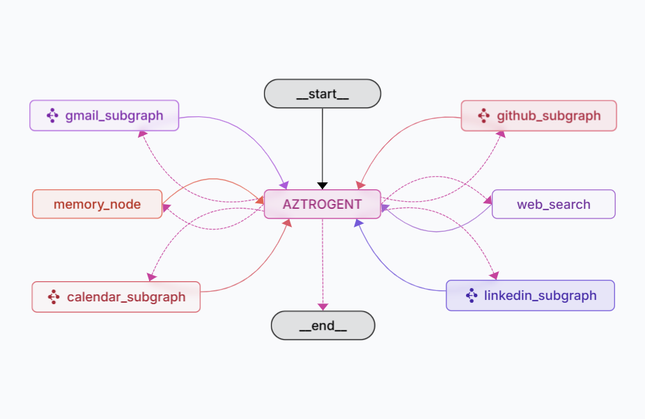

# 🤖 Project Aztrogent

Project Aztrogent is an advanced AI Agent orchestration system that helps users manage various tasks efficiently across multiple platforms including LinkedIn, GitHub, Gmail, and Google Calendar. Built with LangGraph and powered by Google Gemini, Aztrogent provides a seamless interface for task delegation and execution. Aztrogent learns from conversations, store important information about the user to improve its responses.

<p align="center">
  
</p>

## 🚀 Features

- [x] **Multi-Agent Architecture**: Specialized agents for different services:
  - LinkedIn Agent
  - GitHub Agent
  - Email Agent
  - Calendar Agent

- [x] **Intelligent Task Delegation**: Aztrogent agent intelligently delagates tasks to specialized agents (represented as sub-graphs)
- [x] **Memory Management**: Built-in memory system for personalized interactions
- [x] **Human-in-the-Loop**: Confirmation & Feedback system for critical actions 
- [x] **Retry Mechanism**: Error handling with automatic retries for Tool Calling
- [x] **Web Search Integration**: Real-time information gathering capabilities

## Architecture

<table>
  <tr>
    <td></td>
    <td></td>
  </tr>
</table>

## Agents

### **1. Aztrogent** 
It's the main agent that can delegate tasks to other specialized agents. It can search the web and manage memories about the user.

### **2. LinkedIn Agent** 
This agent can handle tasks related to LinkedIn. It can upload, delete posts and get user profile information from LinkedIn. This agent can delegate post writing tasks to another sub-agent.

### **3. GitHub Agent** 
This Agent can perform certain actions related to GitHub. It can:
- Search repositories
- Star repositories
- View and manage personal repositories
- Access user profile information
- View starred repositories
- Browse user projects
- Get Followers of the user
- List repositories for specific users

### **4. Email Agent** 
It is specialized at completing Gmail related tasks. Thi agent can:
- Send, read, and manage emails
- Handle email threads and replies
- Organize emails with labels
- Create email drafts
- Access user's profile information

### **5. Google Calendar Agent** 
This agent can access and manage user's google calendar. It can:
- Create, Update, Delete Events
- Add events using natural language
- Find Events
- Find free slots on calendar
- Get Current Data/Time

## 🛠️ Tech Stack

- **Frameworks**: LangGraph, LangMeme
- **Language Models**: 
  - Google Gemini 2.0 Flash
  - Llama 3.3 70b
- **Embeddings**: Cohere Multilingual V3
- **Tools**: 
  - Composio for 3rd party integrations
  - Tavily for web search

## 📋 Prerequisites

- Python 3.11+
- Poetry or UV package manager
- Required API keys:
  - Google API Key
  - Groq API Key
  - Composio API Key
  - Tavily API Key
  - Cohere API Key (You can also use OpenAI embeddings)
  - LangSmith API Key

## 🚀 Installation

1. Clone the repository:
```bash
git clone https://github.com/yourusername/project-aztrogent.git
cd aztrogent
```
2. Create and Activate Virtual Environment:
- For poetry, run:
```bash

poetry shell
```
- If you're using uv, run:
```bash
uv venv
```

3. Install dependencies using Poetry (or UV):
```bash
poetry install
```

4. Set up environment variables:
```bash
cp .env.example .env
```
Add your API keys in `.env` file. 

5. Composio Tools Integration
For using Composio tools, you need to add Integrations for the services being used. This can either be done manually on [Composio Apps](https://app.composio.dev/apps) (Recommended way) or running the following script:
```bash
composio add github likedin gmail googlecalendar
```
6. Run the Project in LangGraph studio
- If you want to use in-memory version of LangGraph studio, run this command:
```bash
poetry run langgraph dev
```
- If you have docker installed, you can run the studio using the following command:
```bash
langgraph build
langgraph up
```

> [!NOTE]
> In LangGraph Studio, each Agent can also be run and tested separately.

## 🔧 Configuration

The project uses a modular configuration system. Each agent can be configured separately:

- Aztrogent configuration: `src/aztrogent_agent/configuration.py`
- LinkedIn Agent configuration: `src/linkedin_agent/configuration.py`
- GitHub Agent configuration: `src/github_agent/configuration.py`
- Email Agent configuration: `src/email_agent/configuration.py`
- Calendar Agent configuration: `src/calendar_agent/configuration.py`

## 👥 Contributing

Feel free to contribute to this project by submitting issues and pull requests.